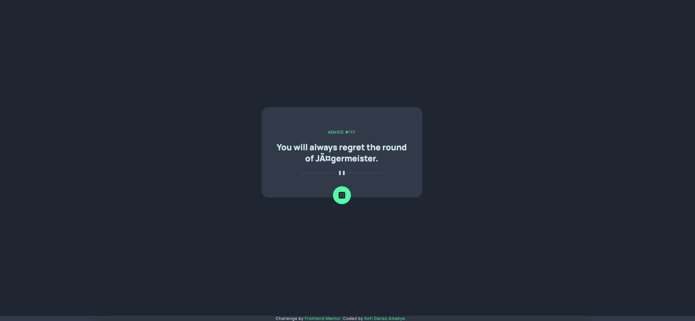

# Frontend Mentor - Advice generator app solution

This is a solution to the [Advice generator app challenge on Frontend Mentor](https://www.frontendmentor.io/challenges/advice-generator-app-QdUG-13db). Frontend Mentor challenges help you improve your coding skills by building realistic projects.

## Table of contents

- [Overview](#overview)
  - [Screenshot](#screenshot)
  - [Links](#links)
- [My process](#my-process)
  - [Built with](#built-with)
- [Author](#author)
- [Acknowledgments](#acknowledgments)

## Overview

### Screenshot



### Links

- Solution URL: [(https://github.com/Kofiastro/adviceGeneratorApp)]
- Live Site URL:[(https://advice-generator-app-6s9z-60w5etkl4-kofiastro.vercel.app/)]

## My process
This is my first react web app using Api's.This project has taught me alot about understanding the Journey in web dev..Practicing by working on projects you don't fully understand will help you learn alot.I started off with tailwindcss and being able to integrate it to react was very ineteresting.With react i will say understanding the basic concepts of what makes a react app is the foundation to mastering react.

### Built with

- React with Vite
- TailwindCss

### What I learned

Alot has been grasped.From components to hooks to states to using props and transitioning to context Api has really been ey opening.

```jsx
 function advicegeneratorUI({}) {
  const { advice, adviceText } = useContext(AdviceContext)
  useEffect(() => {
    adviceApi()
  })
  //Gen and fetching  the advice Api
  const adviceApi = async () => {
    try {
      const response = await fetch("https://api.adviceslip.com/advice")
      const data = await response.json()
      if (!response.ok) {
        adviceText("Advice Loading")
      }
      adviceText(data.slip.advice)
    } catch (error) {
      console.log(error)
      adviceText("OOps!,Advice on Pause")
    }
  }
  return (
```
## Author

- Frontend Mentor - [@Kofiastro](https://www.frontendmentor.io/profile/kofiastro)

## Acknowledgments

Big thanks to Traversy Media and the frontendmentor team 🎉
